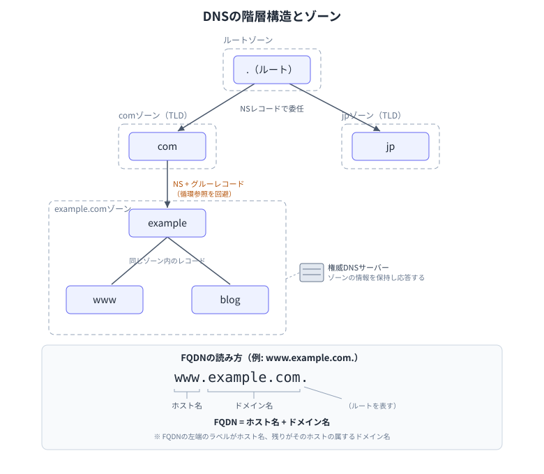
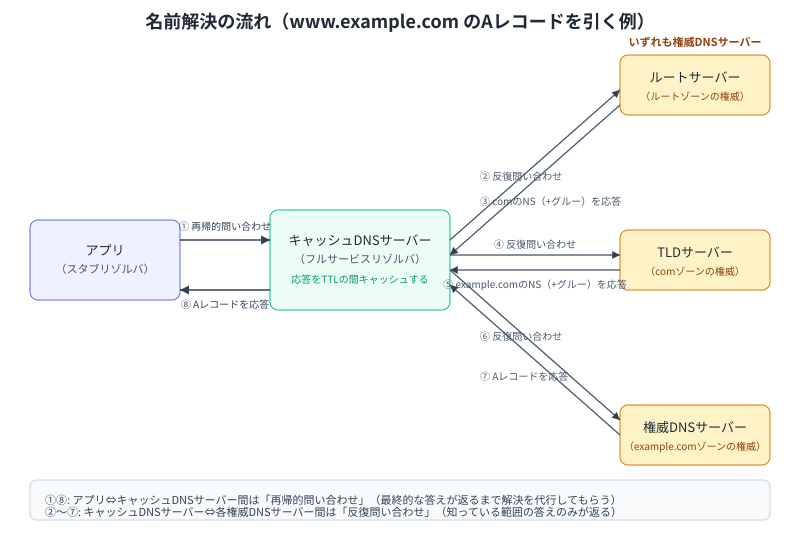
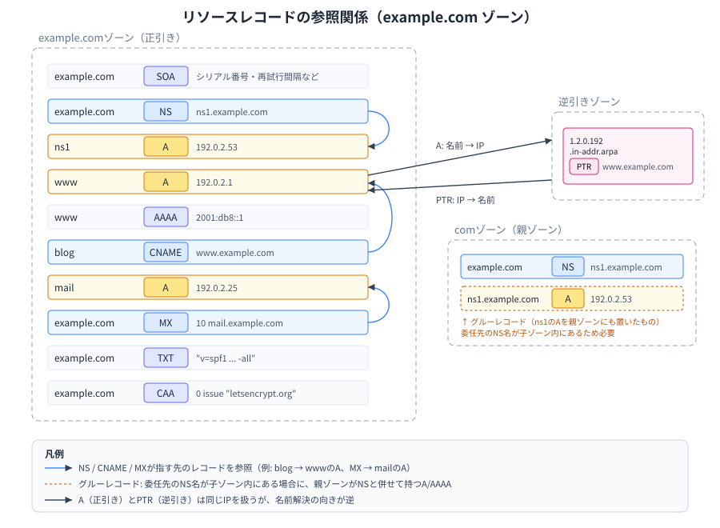

## 概要図

ドメイン名の階層構造とゾーンの関係。

キャッシュDNSサーバーが権威サーバーへ問い合わせながら名前解決する流れ。

ゾーン内のリソースレコードが互いに参照し合う関係。

## DNS (Domain Name System)

ドメイン名とIPアドレスを対応付ける分散型のシステム。  
階層構造を持つデータベースとして世界中のネームサーバーに分散管理されている。

## ドメイン名

ドット区切りの階層構造を持つ、人間が読みやすい名前。  
右側ほど上位の階層を表す（例: `www.example.com` では `com` がTLDで、その上にルートがある）。

## FQDN (Fully Qualified Domain Name)

ルートまでのすべての階層を省略せずに記述した完全なドメイン名。  
末尾にルートを表す `.` を含める場合がある（例: `www.example.com.`）。

## ゾーン

DNSの管理単位。  
1つのドメイン、またはその一部を管理する権限の範囲を指す。

## 権威DNSサーバー

特定のゾーンの情報を実際に保持し、問い合わせに正式な回答を返すサーバー。  
そのゾーンについて「権威を持つ」と表現される。

## ルートサーバー

DNSの階層構造の最上位に位置し、TLDサーバーの情報を管理するサーバー。  
世界に13系統存在し、実体はエニーキャストで多数配置されている。

## TLD (Top Level Domain)

ドメイン名の最上位階層。  
`com` `net` `jp` のような分類がある。

- gTLD (generic TLD)
    - `com` `net` `org` など特定の国に属さないもの
- ccTLD (country code TLD)
    - `jp` `uk` など国や地域を表すもの

## ネームサーバー

DNSサーバーの総称。権威DNSサーバーとキャッシュDNSサーバーの両方を含む。  
ドメイン登録の文脈では、NSレコードで指定する権威DNSサーバーを指すことが多い。

## キャッシュDNSサーバー（フルサービスリゾルバ）

クライアントからの問い合わせを受け、権威サーバーへの問い合わせを代行して結果をキャッシュするサーバー。  
リカーシブサーバーとも呼ばれる。

## スタブリゾルバ

OSやアプリケーションに組み込まれている、キャッシュDNSサーバーに問い合わせを送るだけの単純なクライアント。

## 再帰的問い合わせ

クライアントがキャッシュDNSサーバーに対して行う問い合わせ。  
最終的な回答が得られるまでサーバー側が代わりに解決を行うことを要求する。

## 反復問い合わせ

キャッシュDNSサーバーが権威サーバーに対して行う問い合わせ。  
権威サーバーは知っている範囲の答え、または次に問い合わせるべきサーバーの情報のみを返す。

## 名前解決

ドメイン名からIPアドレスを求める（またはその逆を行う）一連の処理。

## リソースレコード

ゾーンファイルに記述される、DNSが管理する情報の1レコード。  
代表的なタイプは以下の通り。

- A
    - ドメイン名とIPv4アドレスを対応付ける
- AAAA
    - ドメイン名とIPv6アドレスを対応付ける
- CNAME
    - ドメイン名の別名（正式名への参照）を定義する
- MX
    - ドメイン宛のメールを処理するサーバーを指定する
- TXT
    - 任意のテキスト情報を保持する（SPFやドメイン所有権の確認などに利用）
- NS
    - ゾーンの権威DNSサーバーを指定する
- SOA
    - ゾーンの管理情報（シリアル番号、再試行間隔など）を保持する
- PTR
    - IPアドレスからドメイン名を引く逆引きに使う
- CAA
    - ドメインに証明書を発行できるCA（認証局）を制限する
- SRV
    - 特定のサービスを提供するサーバーのホスト名とポートを指定する

## グルーレコード

委任先の権威DNSサーバーのホスト名が委任先ゾーン内にある場合（`example.com` に対する `ns1.example.com` など）に、親ゾーンがNSレコードと併せて持つそのサーバーのA/AAAAレコード。  
これがないと、権威DNSサーバーの名前解決にその権威DNSサーバー自身への問い合わせが必要になり、循環参照が起きる。

## TTL (Time To Live)

リソースレコードをキャッシュしておける有効期間（秒）。  
値はリソースレコードごとに設定される。

## サブドメイン

あるドメインの下位に作成されるドメイン（例: `example.com` に対する `blog.example.com`）。

## ゾーン転送

権威DNSサーバー間でゾーン情報を複製する仕組み。  
プライマリサーバーからセカンダリサーバーへ転送される。

## DNSSEC (DNS Security Extensions)

DNSの応答が改ざんされていないことを電子署名で検証できるようにする拡張仕様。

## DNSキャッシュポイズニング

偽の応答をキャッシュDNSサーバーに覚え込ませ、名前解決結果を不正に書き換える攻撃。

## DoH / DoT

DNSの通信を暗号化するプロトコル。

- DoH (DNS over HTTPS)
    - HTTPS上でDNSクエリを送受信する
- DoT (DNS over TLS)
    - TLS上でDNSクエリを送受信する

## ラウンドロビンDNS

1つのドメイン名に複数のIPアドレスを登録し、問い合わせのたびに異なる順序で返すことで負荷分散を行う手法。

## WHOIS

ドメイン名の登録者情報や登録日、権威サーバーなどを検索できる仕組み・プロトコル。  
gTLDでは2025年1月以降、後継プロトコルのRDAPが正式な提供手段になっている。
