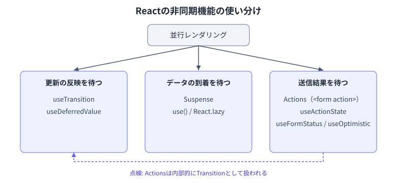

## 前提: 並行レンダリング（Concurrent Rendering）

- React 18から、レンダリングを中断・再開・破棄できるようになった
    - これが以下のすべての機能の土台になっている
- 中断できることで、更新に優先度をつけられる
    - 緊急の更新: 入力・クリックなど、すぐに画面に反映すべきもの
    - 緊急でない更新: 検索結果の表示など、多少遅れても良いもの
- 以降の機能は、いずれも「何を待つか」が異なるだけで、緊急でない更新として扱う点は共通している


## 更新の反映を待つ: Transition

- `startTransition()` / `useTransition()`
    - 中の更新を緊急でないものとしてマークする
    - 実行中の緊急な更新（入力など）を優先し、Transition側は中断・破棄されうる
- `useTransition()` は `isPending` を返すので、ローディング表示に使う

```tsx
const [isPending, startTransition] = useTransition();

function handleClick() {
  startTransition(() => {
    setTab("results");
  });
}
```

- React 19からは非同期関数も渡せる
    - `await` の前後を通じて `isPending` が維持される
- `useDeferredValue()`
    - Transitionが「更新の実行」を遅らせるのに対し、こちらは「値」を遅らせる
    - propsなど、呼び出し元を制御できない値を遅らせたいときに使う
    ```tsx
    const deferredQuery = useDeferredValue(query);
    ```
- 使い分け
    - 更新を自分で起こす（自分のイベントハンドラ内） → `useTransition`
    - 遅らせたい値が外から渡ってくる（props・Contextなど） → `useDeferredValue`


## データの到着を待つ: Suspense

- `<Suspense fallback={...}>`
    - 子要素がまだ準備できていない間、宣言的にフォールバックを表示する
- `use()`
    - レンダリング中にPromiseやContextを読む
    - Promiseがまだ解決していなければ、最も近い `Suspense` にフォールバックする
- `React.lazy()`
    - コンポーネントのコード分割も同じSuspenseの仕組みに乗る
- エラーは`Suspense`ではなく [Error Boundary](#エラーを処理する-error-boundary) が担当する
    - 待つ役割とエラー処理の役割を分離している
- Transition中にSuspenseへ入った場合、フォールバックには戻らず既存の表示を保ったまま更新される
    - `useTransition` と組み合わせることでちらつきを防げる
    ```tsx
    function TabContainer() {
      const [tab, setTab] = useState("about");
      const [isPending, startTransition] = useTransition();

      function selectTab(nextTab) {
        startTransition(() => {
          setTab(nextTab);
        });
      }

      return (
        <>
          <TabButton onClick={() => selectTab("about")}>About</TabButton>
          <TabButton onClick={() => selectTab("posts")}>Posts</TabButton>

          <div style={{ opacity: isPending ? 0.6 : 1 }}>
            <Suspense fallback={<Spinner />}>
              {tab === "about" ? <AboutTab /> : <PostsTab />}
            </Suspense>
          </div>
        </>
      );
    }
    ```
    - `selectTab` を `startTransition` でラップしているので、タブ切り替えでSuspense配下（`AboutTab` / `PostsTab`）がサスペンドしても `fallback` には戻らない
        - `startTransition` でラップしていない場合、切り替えた瞬間に `fallback` が表示され、それまでの内容が消える
    - 切り替え中であることは `isPending` で分かるので、`opacity` を下げるなど、待っていることを示す表現に使う


## エラーを処理する: Error Boundary

- レンダリング中に投げられた例外をキャッチし、代わりにフォールバックUIを表示するコンポーネント
    - 対象はレンダー関数・コンストラクタ・ライフサイクルメソッド内の同期的な例外
- クラスコンポーネントとしてのみ実装できる（フック版は存在しない）
- 自作せず `react-error-boundary` などのライブラリを使うことが多い
    - `ErrorBoundary` コンポーネントと `useErrorBoundary()` を提供し、関数コンポーネント中心のコードから扱いやすくなる
- キャッチできないもの
    - イベントハンドラ内の例外（`try/catch` で個別に処理する）
    - `setTimeout` やPromiseのコールバック内の例外（同期的なレンダー処理の外側のため）
    - サーバーサイドレンダリング中の例外
    - Error Boundary自身で発生した例外（キャッチするには、さらに外側にError Boundaryが必要）
- Suspenseとの関係
    - `use()` が読んでいるPromiseがreject、あるいは`React.lazy()`の読み込みが失敗すると、最も近いError Boundaryにエラーが伝播する
    - `Suspense`と組み合わせるときは、外側をError Boundaryで囲むのが基本形
    ```tsx
    <ErrorBoundary fallback={<ErrorMessage />}>
      <Suspense fallback={<Spinner />}>
        <Profile />
      </Suspense>
    </ErrorBoundary>
    ```
    - 配置の粒度
        - アプリ全体を1つで囲むと、一部のエラーで画面全体が失われる
        - セクション単位など、失っても許容できる範囲ごとに配置する


## 送信結果を待つ: Actions

- `<form action={fn}>`
    - フォームの送信処理を関数として渡す形式
    - Actionsは内部的にTransitionとして扱われる
- `useActionState()`
    - 送信中の状態と、送信結果（戻り値）を保持する
    ```tsx
    const [state, formAction, isPending] = useActionState(submitAction, initialState);
    ```
    - `useReducer()` との関係
        - `(前回の状態, 入力) => 次の状態` という形はほぼ同じ
        - 違いは、渡す関数が非同期でよい（`await`できる）こと、`isPending` を自動で持つこと、`formAction` を `<form action>` に渡す形でフォームと統合されていること
        - 「非同期対応・pending状態・フォーム統合をあらかじめ組み込んだ`useReducer`」と捉えると理解しやすい
- `useFormStatus()`
    - `<form>` の子コンポーネントから、送信中かどうかを読む
    - propsのバケツリレーが不要になる
- `useOptimistic()`
    - サーバーの結果を待たずに、楽観的な値を先に表示する
    - 結果が返ってきたら実際の値に置き換わる
- 使い分け
    - 状態をどこで使うか
        - フォームを持つコンポーネント自身 → `<form action={fn}>` / `useActionState`
        - 送信ボタンなど子コンポーネントから使う → `useFormStatus`（propsのバケツリレーが不要）
    - 送信結果（戻り値）が必要か
        - バリデーションエラーなど結果を画面に反映したい → `useActionState`
        - pending状態だけ分かればよい → `<form action={fn}>` 単体 または `useFormStatus`
    - 結果を待たずに見た目を先に進めたいか
        - いいねボタンやメッセージ送信のように即時反映したい → `useOptimistic` を追加で組み合わせる
        - 他の3つと直交する機能なので、併用が前提


## 使い分けマップ




## 注意点

- レンダリング中に新しいPromiseを作らない
    - 毎回別のPromiseになり、`use()` が無限にサスペンドし続ける
    - Promiseの生成はキャッシュ層やフレームワーク側の責務にする
- `useEffect` でのデータ取得との違い
    - `useEffect` はレンダリング後に実行されるため、一度空の状態が描画されてから取得が始まる（ウォーターフォール状のリクエストになりやすい）
    - Suspenseはレンダリング中に待つため、取得の開始を早められる
- Suspenseは「ローディング表示の共通化」であり、データ取得そのものを行う機能ではない
    - 実際の取得処理はフレームワーク（Next.jsなど）やデータ取得ライブラリが担う


## 参考

- [startTransition – React](https://react.dev/reference/react/startTransition)
- [useTransition – React](https://react.dev/reference/react/useTransition)
- [useDeferredValue – React](https://react.dev/reference/react/useDeferredValue)
- [Suspense – React](https://react.dev/reference/react/Suspense)
- [use – React](https://react.dev/reference/react/use)
- [Catching rendering errors with an error boundary – React](https://react.dev/reference/react/Component#catching-rendering-errors-with-an-error-boundary)
- [react-error-boundary – npm](https://www.npmjs.com/package/react-error-boundary)
- [useActionState – React](https://react.dev/reference/react/useActionState)
- [useFormStatus – React](https://react.dev/reference/react-dom/hooks/useFormStatus)
- [useOptimistic – React](https://react.dev/reference/react/useOptimistic)
