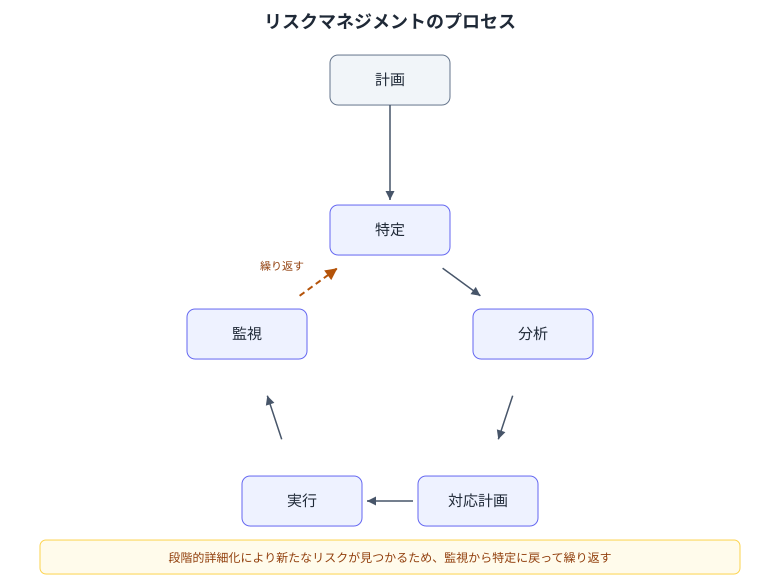
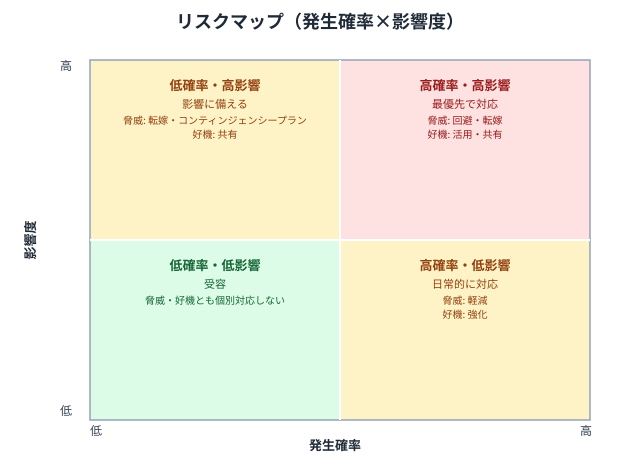

## リスクとは

- リスクと隣接する用語を区別する
    - リスク
        - 発生するかどうか不確実な、将来の事象
        - 発生すると目的にプラスまたはマイナスの影響を与える
    - 課題・イシュー
        - すでに顕在化している問題
        - リスクが顕在化すると課題に変わる
    - 前提
        - 検証せずに真であるとみなしている事柄
        - 誤っていた場合はリスクになる
    - 制約
        - あらかじめ課されている条件・境界
- リスクには2種類ある
    - 脅威
        - 目的にマイナスの影響を与えるリスク
    - 好機
        - 目的にプラスの影響を与えるリスク
        - 見落とされやすいが、脅威と同じ手順で扱う
- 不確実性の性質によって備え方が変わる
    - 既知の未知と未知の未知（ラムズフェルドマトリクス）で区別する
        - 本来は既知の既知・未知の既知を含む4象限だが、リスク管理で扱うのはこの2つ
    - 既知の未知
        - 発生するかどうかわからないが、存在は認識できているリスク
        - 個別に特定し、コンティンジェンシー予備（時間・コストのバッファ）で備える
        - コンティンジェンシー予備とコンティンジェンシープランは別物
            - 予備は「どれだけ余裕を積むか」という枠、プランは「発生したら何をするか」という行動の中身
    - 未知の未知
        - 存在にすら気づいていないリスク
        - 個別対応ができないため、マネジメント予備で備える
- リスクは「事象」と「影響」を分けて記述する
    - 型: `<原因> により <事象> が起き、<影響> が生じる`
    - 事象と影響を混同すると、対応策を考えるときに何を防ぐべきかが曖昧になる

## リスクマネジメントのプロセス

計画 → 特定 → 分析 → 対応計画 → 実行 → 監視の順で進める。

- 計画
    - リスク管理の進め方・役割・許容度を決める
- 特定
    - リスクを洗い出し、リスク登録簿に記録する
- 分析
    - 発生確率・影響度を評価し、優先順位を付ける
- 対応計画
    - 各リスクへの対応戦略と対応策を決める
- 実行
    - 対応策を実施する
- 監視
    - リスクの状況を追跡し、新規リスクを洗い出す

一度きりではなく、プロジェクトの進行に合わせて繰り返す。  
[段階的詳細化](project-management.md) によって新たなリスクが見えてくるため。

## リスクの特定

- 洗い出しの観点
    - スコープ
    - スケジュール
    - コスト
    - 品質
    - 要員・体制
    - 外部依存
    - 技術
    - 法務・セキュリティ
- 洗い出しの方法
    - チェックリストを使う
        - [リスク洗い出しチェックリスト](risk-identification-checklist.md) を参照
        - [スケジュール計画](schedule-planning.md) の「見落としやすいタスク」の一覧はリスク源のチェックリストとしても使える
    - 過去プロジェクトの教訓を確認する
    - プレモーテムを行う
    - [因果関係図](problem-solving.md) の要領で、事象から原因を掘り下げる
- 洗い出す際は事象を具体的に書く
    - 「うまくいかないかもしれない」のような曖昧な記述は、後の分析・対応策の検討ができない

### プレモーテム

プロジェクトの実行前に、あえて「失敗した」と仮定して原因を洗い出す手法。心理学者 Gary Klein が提唱した prospective hindsight（未来を振り返る）の考え方に基づく。

- 目的
    - 楽観的な見立てによる見落としを防ぐ
        - 通常のリスク洗い出しでは「うまくいく前提」で考えてしまい、都合の悪い可能性を軽視しやすいため
    - 発言しにくい懸念を表に出す
        - 「すでに失敗した」という前提を置くことで、計画への批判ではなく単なる原因分析として発言しやすくなる
- 進め方
    1. 未来のある時点でプロジェクトが失敗したと宣言する
        - 「完全に失敗し、誰も使いたがらない結果になった」のように具体的に、かつ大げさすぎない設定にする
    2. 各自が個別に、口に出さず失敗の原因を紙やメモに書き出す
        - 発言してから書かせると、最初の発言者の意見に引っ張られてしまう（アンカリング）
        - 声の大きい人や役職が上の人の意見が場を支配しやすいため、匿名で集めるとより出やすくなる
    3. 1人ずつ理由を発表し、全員分を出し切るまで続ける
    4. 出てきた原因をグルーピングし、重複を整理する
    5. 洗い出した原因を、以降のリスクの分析・対応計画のプロセスにつなげる
        - プレモーテムはリスクを洗い出す手法であり、分析・対応策の検討は通常のリスクマネジメントのプロセスに委ねる
- 進める際の注意点
    - ファシリテーターは最初に自分の意見を言わない
        - 参加者の発言を誘導してしまうため
        - [ファシリテーション](facilitation.md) を参照
    - 「起きるはずがない」という反応が出た原因ほど、実は見落としているリスクであることが多い
    - 悲観的な話で終わらせず、原因ごとに今からできる対策を検討する段階に必ずつなげる
        - 原因を洗い出すだけで終わると、[心理的安全性](psychological-safety.md) を下げるだけになりかねない

## リスクの分析

- 発生確率と影響度をかけ合わせて優先順位を付ける
    - 脅威・好機のどちらにも同じ考え方で使える
        - 好機は影響度をプラス方向で評価する（脅威の「影響が大きいほど危険」に対し、好機は「影響が大きいほど有益」）
- リスクエクスポージャー = 発生確率 × 影響度（金額換算できる場合は影響額）
    - 数値化することで相対比較がしやすくなる
- 発生時期の近さ・検知しやすさも合わせて考慮する
    - 直近に発生しうるリスクや、発生しても気づきにくいリスクは優先度を上げる
- 定量分析（期待金額価値 (EMV)・コンティンジェンシー予備の算出など）は、見積もりの精度が出てきた段階で行う
    - 精度が低い段階で厳密に計算しても、数値の精緻化にコストをかけるだけで判断に寄与しない

### リスクマップ

発生確率×影響度だけでは優先順位しかわからず、そこからどの対応戦略を選ぶかは別に考える必要がある。象限ごとに基本の対応戦略まで結びつけたい場合はリスクマップを使う。

- 個々のリスクを発生確率×影響度の平面上に点としてプロットする図
    - 段階分けではなく連続値で位置関係を表すため、リスクどうしの優先度を比較しやすい
- 縦横の中央で4象限に区切り、象限ごとに基本の対応戦略を対応付ける

- 象限はあくまで基本方針
    - 境界付近のリスクは象限だけで機械的に決めず、個別に対応戦略を検討する
    - 同じ象限内でも、発生確率・影響度が大きいリスクほど優先度は高い

## リスク対応戦略

- 脅威への対応
    - 回避
        - リスクの原因そのものをなくす
    - 転嫁・共有
        - 保険・契約・外部委託などでリスクを第三者に移す
    - 軽減
        - 発生確率または影響度を下げる
    - 受容
        - 対応せず、発生したら対処する
- 好機への対応
    - 活用
        - 好機が必ず実現するようにする
    - 共有
        - 好機を実現しやすい第三者と協力する
    - 強化
        - 発生確率または影響度を上げる
    - 受容
        - 特別な対応はせず、発生したら活かす
- 対応にもコストがかかるため、エクスポージャーを上回るコストの対応策は取らない
- 対応策を決めたら以下も確認する
    - 二次リスク
        - 対応策の実施によって新たに生まれるリスク
    - 残存リスク
        - 対応策を実施してもなお残るリスク

### コンティンジェンシープラン

特定のリスクが発生した場合に何を行うかをあらかじめ定めておく行動計画。発生してから考えると判断が遅れたり場当たり的になったりするため、平常時に用意しておく。

- 対象
    - すべてのリスクに用意すると管理コストが増えすぎるため、優先度が高く、受容以外の対応を選んだリスクに絞る
- 構成要素
    - トリガー条件
        - どうなったら発動するかを、監視できる指標で具体的に定義する
        - 「なんとなく状況が悪化したら」のような曖昧な条件では、発動の判断が遅れたり人によってばらついたりする
    - 発動時の行動
        - 誰が何をどの順序で行うかを具体的に決めておく
    - 発動の判断者
        - トリガー条件を満たしたときに、誰が発動を宣言するかをあらかじめ決めておく
        - 判断者を決めていないと、条件を満たしても発動が遅れる
    - 必要な資源
        - 追加で必要になる予算・人員をあらかじめ見積もっておく
        - コンティンジェンシー予備が原資になることが多い
- 用意しておく理由
    - 平常時の冷静な状態で検討したほうが、質の高い対応策を選べる
    - 関係者とあらかじめ合意しておくことで、発動時の説明・調整のコストを減らせる
- 運用
    - トリガー条件は定期的な監視の中でチェックする
    - トリガーを引いたら、リスク登録簿のステータスを更新し、課題管理に移す
        - [イシューとタスクの区別](project-management-practices.md) に沿って、以降は通常の課題として扱う
    - トリガーを引いた後の具体的な進め方は [リカバリー](recovery.md) を参照
        - コンティンジェンシープランは「何をするか」を事前に決めておくもの、リカバリーは実際に問題が起きたときの進め方
- 好機にも同じ考え方が使える
    - 「都合よく実現したらどう活用するか」をあらかじめ決めておく

## リスク登録簿

洗い出したリスクを一覧管理する台帳。以下の項目を持たせる。

| 項目 | 内容 |
| --- | --- |
| ID | 一意の識別子 |
| リスク事象 | 何が起きるか |
| 原因 | なぜ起きるか |
| 影響 | 起きるとどうなるか |
| 発生確率 | 高・中・低 |
| 影響度 | 大・中・小 |
| エクスポージャー | 発生確率×影響度から算出した優先度 |
| 対応戦略 | 回避・転嫁・軽減・受容など |
| 対応策 | 具体的に何を行うか |
| トリガー条件 | コンティンジェンシープランの発動条件 |
| オーナー | 対応の責任者 |
| 期限 | 対応策の実施期限 |
| ステータス | 未対応・対応中・監視中・クローズなど |

- オーナーは必ず個人にする
    - チームや役職を割り当てると、誰も自分ごととして動かなくなるため
- 更新日を残す
    - 棚卸しされているかどうかを後から確認できるようにするため
- クローズしたリスクも削除せず残す
    - 教訓として再利用できるため

## 監視とコントロール

- 定例でリスク登録簿を棚卸しする
    - 新規リスクの追加
    - 既存リスクの発生確率・影響度の再評価
    - 対応済みリスクのクローズ
- リスクが顕在化したら課題管理に移す
    - [イシューとタスクの区別](project-management-practices.md) と同様に、リスク・イシュー・タスクを混同しないようにする
- どこまで自分で対応し、どこからエスカレーションするかの基準を事前に合意しておく
    - [委任](delegation.md) のエスカレーション基準と同様の考え方
- プロジェクト終結時に、発生したリスク・しなかったリスクを含めて教訓としてまとめる

## アンチパターン

- 登録簿を作った時点で満足し、以降更新されない
    - 形骸化し、実際の判断に使われなくなる
- 「スケジュールが遅れるかもしれない」のような曖昧な事象記述
    - 対応策も判断基準も立てられない
- すべてのリスクに「軽減」だけを選ぶ
    - 回避・転嫁の余地を検討せずに思考停止している状態
- オーナーがチーム名になっている
    - 誰も自分の責任と思わず、対応が進まない
- 顕在化したのに登録簿上は「未発生」のまま
    - 課題管理に移されず、対応の抜け漏れにつながる
- リスクを報告すると責められるため、誰も挙げなくなる
    - [心理的安全性](psychological-safety.md) が損なわれている状態
- 発生確率・影響度の数値の精緻化に時間をかけすぎる
    - [優先順位判断](prioritization.md) と同様、判断のコストが効果を上回ってしまう
- コンティンジェンシー予備を積んだ分だけ必ず使い切る
    - パーキンソンの法則により、余裕があるとその分だけ作業が延びてしまう

## 参考

- PMBOK 第5版
- [ノウン・アンノウン - Wikipedia](https://ja.wikipedia.org/wiki/%E3%83%8E%E3%82%A6%E3%83%B3%E3%83%BB%E3%82%A2%E3%83%B3%E3%83%8E%E3%82%A6%E3%83%B3)
- [プロジェクトマネジメント](project-management.md)
- [リカバリー](recovery.md)
- [問題解決](problem-solving.md)
