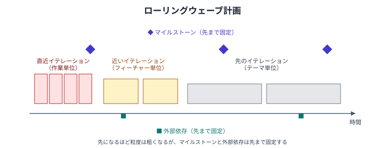

## アジャイル開発でのスケジュール計画の進め方

イテレーション（スプリント）を単位とし、以下の考え方で計画する。

## 固定期間×可変スコープ

- イテレーションはタイムボックス（期間固定の作業単位）として扱う
    - 期間を固定し、スコープ側で調整する
- [見積もりとバッファ](schedule-planning.md#見積もりとバッファ) のようにバッファで吸収するのではなく、スコープの取捨選択で吸収する

## 計画の階層とローリングウェーブ計画

- 計画をプロダクトバックログ・リリース計画・イテレーション計画の3階層で持つ
    - プロダクトバックログ: 実現したいことの一覧。粒度は粗い
    - リリース計画: いつまでにどこまで作るかの大まかな計画
    - イテレーション計画: 直近のイテレーションで何をやるかの計画。ここだけ作業単位まで分解する
- 直近のイテレーションだけ詳細化し、先のイテレーションは粗いまま置く
    - [段階的詳細化](project-management.md) を計画の階層に適用したもので、ローリングウェーブ計画と呼ばれる
    - 先まで詳細化しても、変更のたびに作り直すことになり無駄になりやすいため

## マイルストーンと外部依存

- スコープが動いても、マイルストーンと外部依存は先に固定する
    - [マイルストーンとチェックポイント](schedule-planning.md#マイルストーンとチェックポイント) を参照
    - 外部依存はイテレーション内で吸収できず、リードタイムも読めないため、早期に洗い出して各マイルストーンに紐づける
    - 洗い出しには [見落としやすいタスク](schedule-planning.md#見落としやすいタスク) の「外部依存に関するもの」が使える

## ベロシティによる予測

- ベロシティ（1イテレーションで完了したストーリーポイントの合計）を計測する
    - 見積もり自体は [ストーリーポイントマトリクス](story-point-matrix.md) を参照
    - 直近数回の平均を使い、幅を持たせて扱う
- 残りのバックログの合計ポイントをベロシティで割り、必要なイテレーション数を予測する
    - リリースバーンダウンチャートで可視化すると、進捗と完了時期の見通しが伝わりやすい
    - 完了の判定は [タスクの完了条件](schedule-planning.md#タスクの完了条件) を参照

## アンチパターン

- ベロシティを目標値・評価指標として使う
    - ポイントが膨らみ、予測に使えなくなる
- スコープを守るためにイテレーションの期間を延ばす
    - タイムボックスが崩れ、予測の基準が失われる
- 先のイテレーションまで詳細に分解しきる
    - 変更のたびに捨てる計画を作ることになる
- 外部依存をイテレーション直前まで放置する
    - リードタイムを吸収できず、イテレーションが止まる

## 参考

- [スケジュール計画](schedule-planning.md)
- [プロジェクトマネジメント](project-management.md)
- [ストーリーポイントマトリクス](story-point-matrix.md)
- [ユーザーストーリーの分割](split-user-story.md)
- [開発速度向上](development-speed.md)
