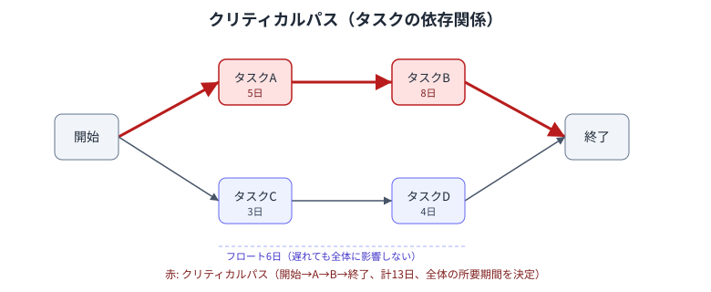

## スケジュール計画の進め方

以下の順で進める。

1. ゴールから逆算して成果物を洗い出す
2. 成果物を作るための工程・タスクに分解する（WBS）
3. タスクごとに見積もりを行う
4. タスクの依存関係を整理する
5. 要員を割り当てる
6. バッファを設定する
7. 関係者と合意する

[段階的詳細化](project-management.md) の性質上、一度で確定させることはできない。  
プロジェクトが進むにつれて計画の粒度を細かくし、都度見直す。

## タスクの洗い出し

- 過去の類似案件をベースにする
    - イチから計画するよりも効率が良く、漏れも防ぎやすくなるため
- 工程ごとに成果物一覧を作る
    - 成果物の漏れを防ぐため
    - モノ
    - 機能
    - ドキュメント
    - 非機能要件や異常系などに関するものは漏れやすいので注意
- 成果物を作業単位まで分解する（WBS）
    - 進捗を判断できる粒度、かつ担当者が1人に決まる粒度まで分解する
    - WBSの最小単位はワークパッケージと呼ばれる
    - 粗すぎると進捗が実質的に測れず、細かすぎると管理コストが見積もりの精度向上を上回る
    - 分解しきれずタスクが大きくなりすぎる場合は [ユーザーストーリーの分割](split-user-story.md) の考え方が使える

見落としや遅れを減らすコツは以下の通り。

- ゴールから逆算する
- フレームワークやチェックリストで網羅的に確認する
- 定期的にスケジュールを見直すチェックポイントを設ける

## 見落としやすいタスク

洗い出しの際に抜けやすいタスク。

- 開発工程そのものに埋もれやすいもの
    - 調査、実現性確認、テスト、レビュー、差し戻し対応、リハーサル
- ドキュメントに関するもの
    - 計画書や手順書の作成、既存ドキュメントの更新
- 人・組織に関するもの
    - 教育、引き継ぎ、ステークホルダー調整
- 外部依存に関するもの
    - アカウント払い出し、権限申請、ネットワーク構築、外部監査、外部診断、データ授受、ライブラリ更新など
- その他
    - リスク発生対応、変更管理

この一覧は [リスク洗い出しチェックリスト](risk-identification-checklist.md) のリスク源としても使える。

## タスクの完了条件

- タスクごとに完了条件を明確にする
    - 完了だと思ったら完了でなかったことを防ぐため
    - モノができれば完了か、レビューまで必要か、成果物の引き渡しまで必要か、関係者へのアナウンスまで必要か
    - レビューは誰に受ければ良いか明確にする
        - 観点ごとにレビューが必要なことがある（設計観点、品質観点、運用観点、営業観点など）

## 依存関係とクリティカルパス

- タスク間の依存関係は、プレシデンス・ダイアグラム法（PDM）で4種類に分類できる
    - FS（終了-開始）: 先行タスクが終わってから後続タスクを開始できる。もっとも一般的
    - SS（開始-開始）: 先行タスクが始まったら後続タスクも始められる
    - FF（終了-終了）: 先行タスクが終わってから後続タスクを終えられる
    - SF（開始-終了）: 先行タスクが始まってから後続タスクを終えられる。まれ
- 依存関係をつなげた最長経路をクリティカルパスと呼び、これを求める手法をクリティカルパス法（CPM）と呼ぶ
    - プロジェクト全体の所要期間を決定するため、ここを短縮しない限り全体の期間は縮まらない
    - クリティカルパス上のタスクは遅延がそのまま全体の遅延になる
- クリティカルパス上にないタスクにはフロート（余裕日数）がある
    - フロートの範囲内であれば遅れても全体には影響しない
    - フロートを使い切ったタスクは新たにクリティカルパスの一部になる

遅延時にクリティカルパスへ手を打つ方法（クラッシング・ファストトラッキングなど）は [リカバリー](recovery.md#スケジュール) を参照。

## 見積もりとバッファ

- サイズと不確実性から見積もる
    - [ストーリーポイントマトリクス](story-point-matrix.md) を参照
- バッファはタスクごとに個別に積まず、工程末尾やプロジェクト全体でまとめて持つ
    - クリティカルチェーン・プロジェクト・マネジメント（CCPM）のプロジェクトバッファ・合流バッファの考え方
    - タスクごとに積むと、パーキンソンの法則や学生症候群によってそのバッファが必ず消費されてしまうため
- 稼働率を100%で計算しない
    - 会議、割込み対応、レビュー待ちなどが必ず発生するため
- 個別のリスクに備えるコンティンジェンシー予備、未知のリスクに備えるマネジメント予備は [リスク管理](risk-management.md#不確実性の性質によって備え方が変わる) を参照

## マイルストーンとチェックポイント

- マイルストーンは成果物の完成や重要な判断のタイミングに置く
    - 進捗を可視化し、遅れを早期に検知できるようにするため
- 定期的にスケジュールを見直すチェックポイントを設ける
    - 見直しの周期はあらかじめ計画時に決めておく
        - 都度その場で決めると、都合の悪いタイミングでは見直しが先送りされやすいため

## 合意とベースライン

- 計画は関係者と合意して初めて機能する
    - 合意のない計画は、実行段階で「聞いていない」という反発を招く
- 合意した時点の計画をベースラインとして残す
    - 以降の変更を差分として追跡できるようにするため
    - 変更した場合は理由も残す（[ドキュメント管理](document-management.md#理由) を参照）

## アンチパターン

- タスクの粒度が粗すぎる
    - 進捗が実質的に測れず、遅れに気づくのが遅くなる
- 全タスクを最短見積もりで並べる
    - 少しの遅延やイレギュラーで即座にスケジュール全体が破綻する
- バッファをタスクごとに隠し持つ
    - パーキンソンの法則により、隠したバッファも含めて必ず使い切られる
- クリティカルパスを把握していない
    - どのタスクの遅延が全体に影響するのか判断できず、リカバリーの手の打ちどころを誤る
- 完了条件が「実装が終わったら」だけになっている
    - レビューや引き渡しが漏れ、後工程で手戻りが発生する
- 一度引いた線表を更新しない
    - 実態と乖離し、誰も参照しなくなる
- 稼働率100%で計画する
    - 割込みや調整が発生した瞬間に破綻する
- 遅れの報告が上がってこない
    - [心理的安全性](psychological-safety.md) が損なわれている状態。発覚が遅れるほどリカバリーの選択肢が狭まる

## 参考

- [プロジェクトマネジメント](project-management.md)
- [プロジェクトマネジメント_プラクティス](project-management-practices.md)
- [リスク管理](risk-management.md)
- [リスク洗い出しチェックリスト](risk-identification-checklist.md)
- [リカバリー](recovery.md)
- [ストーリーポイントマトリクス](story-point-matrix.md)
- [ユーザーストーリーの分割](split-user-story.md)
- [優先順位判断](prioritization.md)
